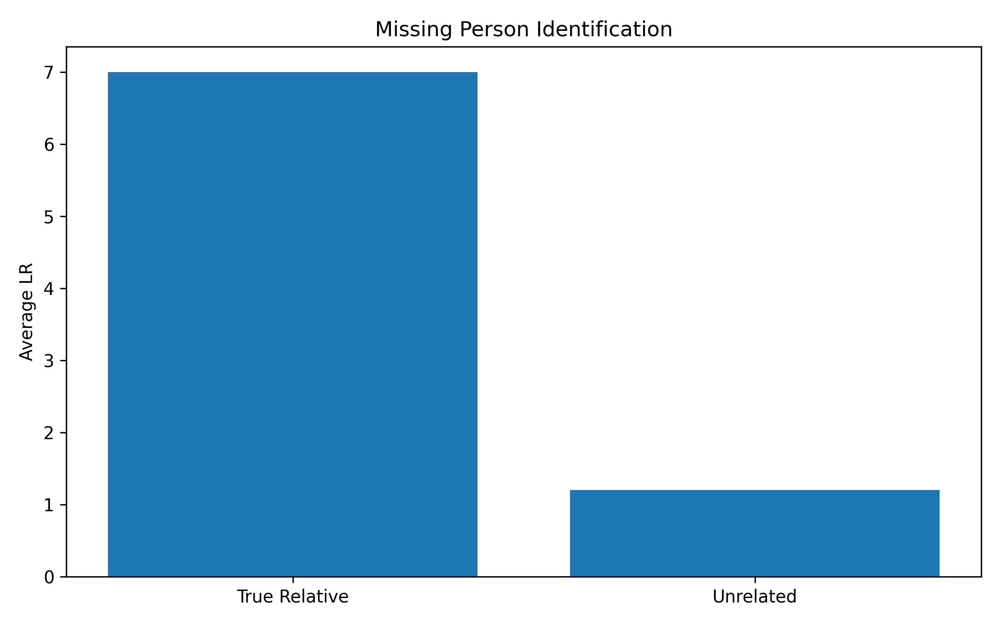

# Forensic Kinship Analysis Lab

Educational forensic genetics project for simulating STR inheritance and kinship analysis.

## Overview

This project explores how short tandem repeat (STR) profiles can be used to evaluate biological relationships in forensic genetics.

The framework simulates Mendelian inheritance, parent-child relationships, sibling relationships, and missing person identification scenarios. It also demonstrates how likelihood ratios can be used to quantify evidential support for biological relatedness.

The project focuses on:

* STR inheritance simulation
* Parent-child relationship testing
* Sibling relationship simulation
* Missing person identification
* Unrelated individual comparison
* Kinship likelihood ratios
* Monte Carlo experiments

---

## Scientific Motivation

Forensic kinship analysis is widely used in missing persons investigations, disaster victim identification (DVI), immigration testing, and human identification.

This project demonstrates how biological relationships can be evaluated using simulated STR profiles and likelihood-based approaches.

---

## Applications

Potential applications of kinship analysis include:

* Missing persons investigations
* Disaster victim identification (DVI)
* Human remains identification
* Family reunification cases
* Immigration relationship testing
* Forensic intelligence investigations

---

## Parent-Child Experiment

Evaluates whether biological parents obtain higher likelihood ratios than unrelated individuals.


Example results:

| Relationship | Average LR |
| ------------ | ---------- |
| True parent  | 7.000      |
| Unrelated    | 1.170      |

The experiment simulates STR inheritance and compares likelihood ratios between true parent-child pairs and unrelated individuals.

Results demonstrate that biological parents consistently obtain substantially higher likelihood ratios than unrelated individuals, supporting the use of STR markers in forensic kinship analysis.

---

## Sibling Relationship Experiment


| Relationship | Average Shared Alleles |
| ------------ | ---------------------- |
| Siblings     | 6.897                  |
| Unrelated    | 3.101                  |

Biological siblings share substantially more STR alleles than unrelated individuals, demonstrating the usefulness of STR markers for forensic kinship inference.

---

## STR Inheritance Example


The child inherits one allele from each biological parent at every STR locus.

---

## Missing Person Identification Experiment



| Comparison    | Average LR |
| ------------- | ---------- |
| True Relative | 7.0        |
| Unrelated     | 1.20       |

The experiment evaluates whether a biological relative can correctly identify an unknown individual using STR profiles and kinship likelihood ratios.

Results show substantially higher likelihood ratios for true relatives than for unrelated individuals.

---

## Research Questions

1. How can STR inheritance be simulated computationally?
2. How can parent-child relationships be distinguished from unrelated individuals?
3. How do likelihood ratios differ between relatives and unrelated individuals?
4. How can kinship analysis support forensic identification and missing persons investigations?

---

## Methods

* STR profile generation
* Mendelian inheritance simulation
* Parent-child relationship testing
* Sibling relationship analysis
* Missing person identification
* Kinship likelihood ratio calculation
* Monte Carlo experiments
* Data visualization using Python

---

## Project Structure

```text
forensic-kinship-analysis-lab/
│
├── reports/
│   ├── kinship_experiment.png
│   ├── sibling_experiment.png
│   ├── missing_person_experiment.png
│   ├── inheritance_diagram.png
│   ├── kinship_results.csv
│   ├── sibling_results.csv
│   └── missing_person_results.csv
│
├── src/
│   ├── kinship_simulator.py
│   ├── kinship_likelihood.py
│   ├── kinship_experiment.py
│   ├── sibling_experiment.py
│   ├── missing_person_experiment.py
│   ├── plot_kinship_results.py
│   ├── plot_sibling_results.py
│   ├── plot_missing_person_results.py
│   └── plot_inheritance_diagram.py
│
├── tests/
├── notebooks/
├── requirements.txt
└── README.md
```

---

## Reproducibility

Install dependencies:

```bash
pip install -r requirements.txt
```

Run experiments:

```bash
python src/kinship_experiment.py
python src/sibling_experiment.py
python src/missing_person_experiment.py
```

---

## Future Work

* Half-sibling analysis
* Grandparent-grandchild testing
* Cousin relationship inference
* Population allele frequencies
* Frequency-based kinship likelihood ratios
* Bayesian kinship inference
* SNP-based relationship inference
* Forensic genetic genealogy

---

## Citation

If you use this project for educational purposes, please cite the repository:

Gabara A. Forensic Kinship Analysis Lab. GitHub repository.

---

## Disclaimer

This project is intended for educational and research-training purposes only.

It is not validated for forensic casework and must not be used in real investigations.

---

## Author

Agata Gabara
