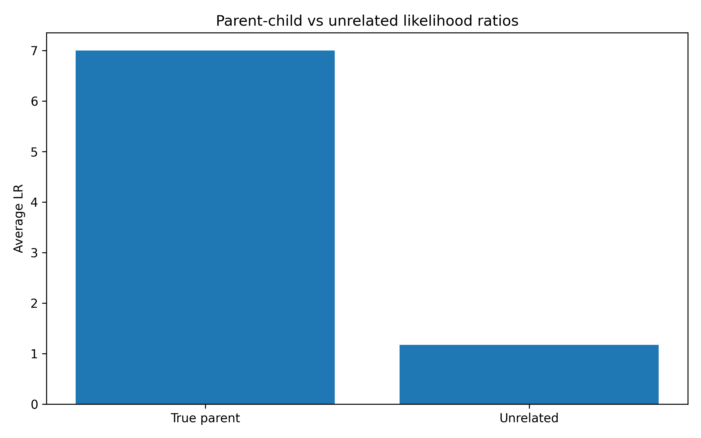
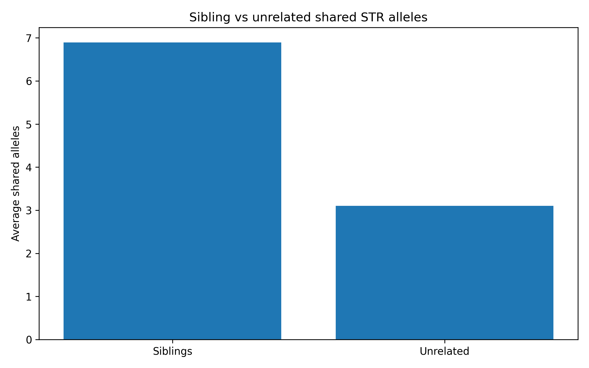
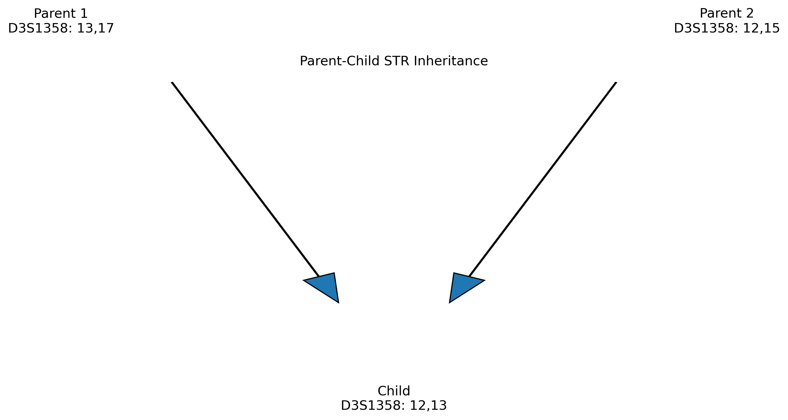

# Forensic Kinship Analysis Lab

Educational forensic genetics project for simulating STR inheritance and kinship analysis.

## Overview

This project explores how STR profiles can be used to evaluate biological relationships in forensic genetics.

The project focuses on:

* STR inheritance simulation
* Parent-child relationship testing
* Sibling relationship simulation
* Unrelated individual comparison
* Kinship likelihood ratios
* Monte Carlo experiments

---

## Scientific Motivation

Forensic kinship analysis is widely used in missing persons investigations, disaster victim identification (DVI), immigration testing, and human identification.

This project demonstrates how biological relationships can be evaluated using simulated STR profiles and likelihood-based approaches.

---

## Parent-Child Experiment

Evaluates whether biological parents obtain higher likelihood ratios than unrelated individuals.



Example results:

| Relationship | Average LR |
| ------------ | ---------- |
| True parent  | 7.000      |
| Unrelated    | 1.170      |

The experiment simulates STR inheritance and compares likelihood ratios between true parent-child pairs and unrelated individuals.

Results demonstrate that biological parents consistently obtain substantially higher likelihood ratios than unrelated individuals, supporting the use of STR markers in forensic kinship analysis.

---

## STR Inheritance Example

=======
## Sibling Relationship Experiment



| Relationship | Average Shared Alleles |
|-------------|------------------------|
| Siblings | 6.897 |
| Unrelated | 3.101 |

Biological siblings share substantially more STR alleles than unrelated individuals, demonstrating the usefulness of STR markers for forensic kinship inference.

---

## STR Inheritance Example

>>>>>>> ae0fafed752204358af24d15c49356d8b20b6a2c


The child inherits one allele from each biological parent at every STR locus.

---

## Research Questions

1. How can STR inheritance be simulated computationally?
2. How can parent-child relationships be distinguished from unrelated individuals?
3. How do likelihood ratios differ between relatives and unrelated individuals?
4. How can kinship analysis support forensic identification and missing persons investigations?

---

## Methods

* STR profile generation
* Mendelian inheritance simulation
* Parent-child relationship testing
* Kinship likelihood ratio calculation
* Monte Carlo experiments
* Data visualization using Python

---

## Project Structure

```text
forensic-kinship-analysis-lab/
│
├── reports/
│   ├── kinship_experiment.png
│   ├── kinship_results.csv
│   └── inheritance_diagram.png
│
├── src/
│   ├── kinship_simulator.py
│   ├── kinship_likelihood.py
│   ├── kinship_experiment.py
│   ├── plot_kinship_results.py
│   └── plot_inheritance_diagram.py
│
├── requirements.txt
└── README.md
```

---

## Future Work

* Sibling likelihood ratios
* Half-sibling analysis
* Grandparent-grandchild testing
* Missing persons identification
* Population allele frequencies
* Frequency-based kinship likelihood ratios
* SNP-based relationship inference

---

## Disclaimer

This project is intended for educational and research-training purposes only.

It is not validated for forensic casework and must not be used in real investigations.

## Author
Agata Gabara
